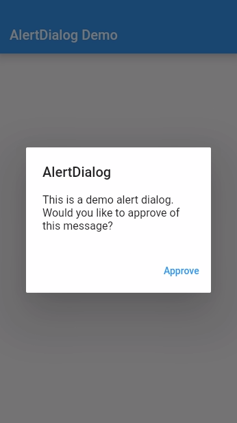
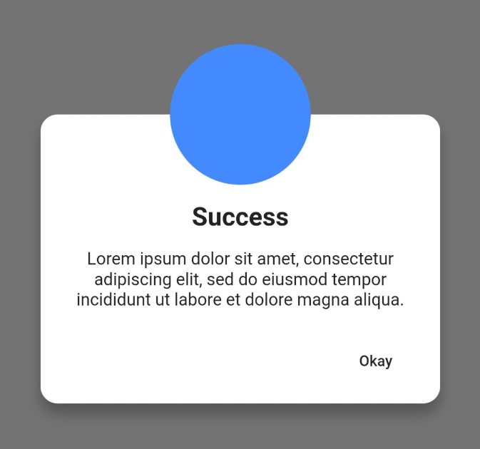

# Alert Dialog

[Documentação oficial do widget](https://api.flutter.dev/flutter/material/AlertDialog-class.html)

De acordo com a documentação oficial, é uma caixa de diálogo de alerta de design de material.

Uma caixa de diálogo de alerta informa o usuário sobre situações que requerem reconhecimento. Uma caixa de diálogo de alerta possui um título opcional e uma lista opcional de ações. O título é exibido acima do conteúdo e as ações são exibidas abaixo do conteúdo.

### 1 - AlertDialog()

O importante desse componente é ser chamado como método para ser chamado de qualquer outra parte da tela. O construtor do próprio receber um contexto e um builder do contexto.

```dart
  // user defined function
  void _showDialog() {
    // flutter defined function
    showDialog(
      context: context,
      builder: (BuildContext context) {
        // return object of type Dialog
        return AlertDialog(
          title: new Text("AlertDialog"),
          content: new Text("This is a demo alert dialog. Would you like to approve of this message?"),
          actions: <Widget>[
            // usually buttons at the bottom of the dialog
            new FlatButton(
              child: new Text("Accept"),
              onPressed: () {
                Navigator.of(context).pop();
              },
            ),
          ],
        );
      },
    );
  }
```

Resultado:




### 2 - Classe Genérica para a aplicação

Uma alternativa é criar uma classe onde todo o aplicativo pode chamar a mesma sem precisar repetir muito código.

```dart
class DialogUtils {
  static DialogUtils _instance = new DialogUtils.internal();

  DialogUtils.internal();

  factory DialogUtils() => _instance;

  static void showCustomDialog(BuildContext context,
      {@required String title, 
      String okBtnText = "Ok",
      String cancelBtnText = "Cancel",
      @required Function okBtnFunction}) {
    showDialog(
        context: context,
        builder: (_) {
          return AlertDialog(
            title: Text(title),
            content: /* Here add your custom widget  */,
            actions: <Widget>[
              FlatButton(
                child: Text(okBtnText),
                onPressed: okBtnFunction,
              ),
              FlatButton(
                  child: Text(cancelBtnText),
                  onPressed: () => Navigator.pop(context))
            ],
          );
        });
  }
 }
```

Chamando a classe na view

```dart
GestureDetector(
      onTap: () =>
              DialogUtils.showCustomDialog(context,
          title: "Gallary",
          okBtnText: "Save",
          cancelBtnText: "Cancel",
          okBtnFunction: () => /* call method in which you have write your logic and save process  */),
      child: Container(),
)
```

### 3 - Custom Dialog

Pode-se optar também em fazer um Dialog customizado, com diferentes tamanhos, cores e formatos. O artigo do Medium mostra como conseguir construir o exemplo abaixo:

https://medium.com/@excogitatr/custom-dialog-in-flutter-d00e0441f1d5

