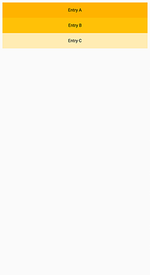
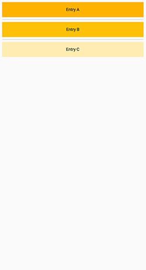

# List View

[Documentação oficial do widget](https://api.flutter.dev/flutter/widgets/ListView-class.html)

De acordo com a documentação oficial, é uma lista rolável de widgets organizados linearmente.

Existem quatro opções para construir um ListView :

### 1 - ListView()
O construtor padrão recebe na propriedade `children` uma lista explícita de widgets. Esse construtor é apropriado apenas para exibições de lista com um pequeno número de filhos:

```dart
  @override
  Widget build(BuildContext context) {
    return Scaffold(
      body: Center(
        child: ListView(
          padding: const EdgeInsets.all(8),
          children: <Widget>[
            Container(
              height: 50,
              color: Colors.amber[600],
              child: const Center(child: Text('Entry A')),
            ),
            Container(
              height: 50,
              color: Colors.amber[500],
              child: const Center(child: Text('Entry B')),
            ),
            Container(
              height: 50,
              color: Colors.amber[100],
              child: const Center(child: Text('Entry C')),
            ),
          ],
        ),
      ),
    );
  }
```
    
Resultado:


 
 ### 2 - ListView.builder()
 O construtor ListView.builder usa um IndexedWidgetBuilder , que renderiza os filhos sob demanda. Esse construtor é apropriado para exibições de lista com um número grande (ou infinito) de filhos:
 
 ```dart
  final List<String> entries = <String>['A', 'B', 'C'];
  final List<int> colorCodes = <int>[600, 500, 100];

  @override
  Widget build(BuildContext context) {
    return Scaffold(
      body: Center(
        child: ListView.builder(
          padding: const EdgeInsets.all(8),
          itemCount: entries.length,
          itemBuilder: (BuildContext context, int index) {
            return Container(
              height: 50,
              color: Colors.amber[colorCodes[index]],
              child: Center(child: Text('Entry ${entries[index]}')),
            );
          },
        ),
      ),
    );
  }
```

Como podemos observar na imagem abaixo, não há mudanças visuais em comparação ao exemplo anterior.
    
Resultado:


 ### 3 - ListView.separated()
O construtor ListView.separated usa dois `IndexedWidgetBuilders`: O `itemBuilder` cria itens filhos sob demanda e `separatorBuilder` cria filhos filhos separadores que aparecem entre os itens filhos. Esse construtor é apropriado para exibições de lista com um número fixo de filhos. no caso do construtor `separated` a propriedade `itemCount`, que nada mais é do que o tamanho da lista, é obrigatória:
 
 ```dart
  final List<String> entries = <String>['A', 'B', 'C'];
  final List<int> colorCodes = <int>[600, 500, 100];

  @override
  Widget build(BuildContext context) {
    return Scaffold(
      body: Center(
        child: ListView.separated(
          padding: const EdgeInsets.all(8),
          itemCount: entries.length,
          itemBuilder: (BuildContext context, int index) {
            return Container(
              height: 50,
              color: Colors.amber[colorCodes[index]],
              child: Center(child: Text('Entry ${entries[index]}')),
            );
          },
          separatorBuilder: (BuildContext context, int index) =>
              const Divider(thickness: 2),
        ),
      ),
    );
  }
```
    
Resultado:



 ### 3 - ListView.custom()
Caso nenhum desses acima funcionem para o seu caso, você ainda pode usar o construtor ListView.custom, que por sua vez, usa um `SliverChildDelegate` , que fornece a capacidade de personalizar aspectos adicionais do modelo filho.

[Veja mais aqui](https://api.flutter.dev/flutter/widgets/ListView/ListView.custom.html)
 


    
  

