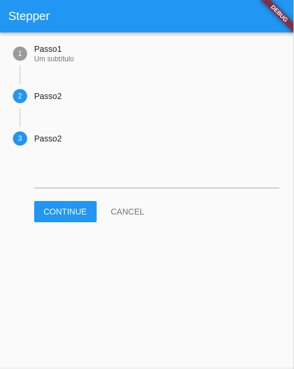

# Stepper

[Documentação oficial do widget](https://api.flutter.dev/flutter/material/Stepper-class.html)

O stepper é um widget para apresentar uma determinada sequências progressiva passo-a-passo, é comum ser usado para algum pequeno formulário ou simples tutorial.

Ele é formado por uma lista de Step que devem ser apresentados um de cada vez.
Um Step é um Widget que recebe no mínimo um título e um conteúdo.

Então, apenas com apenas esses parâmetros já podemos ver o Stepper:

```dart
  List<Step> mySteps = [
    Step(
      title: Text("Passo1"),
      content: TextField(),
    ),
    Step(
      title: Text("Passo2"),
      content: TextField()
    ),
  ];

  @override
  Widget build(BuildContext context) {
    return Scaffold(
      appBar: AppBar(
        title: Text("Stepper"),
      ),
      body: Stepper(
        steps: mySteps,
      ),
    );
  }
```
Resultado:


Mas dessa forma, o stepper ainda não está funcional. 
Para começar a "dar vida" ao stepper vamos adicionar um atributo para o index do passo atual e fazer umas alterações no código.

```dart
  int indexAtual = 0;
  @override
  Widget build(BuildContext context) {
    return Scaffold(
      appBar: AppBar(
        title: Text("Stepper"),
      ),
      body: Stepper(
        steps: mySteps(),
        currentStep: indexAtual,
      ),
    );
  }

  List<Step> mySteps(){
    return [
      Step(
        title: Text("Passo1"),
        subtitle: Text("Um subtítulo"),
        content: TextField(),
        isActive: this.indexAtual == 0
      ),
      Step(
        title: Text("Passo2"),
        content: TextField()
      ),
    ];
  } 
```
Resultado:


Vemos acima que cada Step tem dois botões, um para continuar e outro para cancelar.
Cada função é implementada dentro do Stepper, e faremos isso no próximo passo

```dart
  int indexAtual = 0;
  @override
  Widget build(BuildContext context) {
    return Scaffold(
      appBar: AppBar(
        title: Text("Stepper"),
      ),
      body: Stepper(
        steps: mySteps(),
        currentStep: indexAtual,
        onStepContinue: (){
          if(indexAtual < mySteps().length-1)
            setState(() {
              indexAtual+=1;
            });
        },
        onStepCancel: (){
          if(indexAtual > 0)
            setState(() {
              indexAtual-=1;
            });
        },
      ),
    );
  }

  List<Step> mySteps(){
    return [
      Step(
        title: Text("Passo1"),
        subtitle: Text("Um subtítulo"),
        content: TextField(),
        isActive: this.indexAtual == 0
      ),
      Step(
        title: Text("Passo2"),
        content: TextField(),
        isActive: this.indexAtual >= 1
      ),
      Step(
        title: Text("Passo2"),
        content: TextField(),
        isActive: this.indexAtual >= 2
      ),
    ];
  } 
```
Resultado:



 ### Comentários
Foi apresentado o básico do Stepper. Há muitas outras formas de fazer um Stepper e outros atributos não apresentado, então, leia a documentação e use a criatividade.