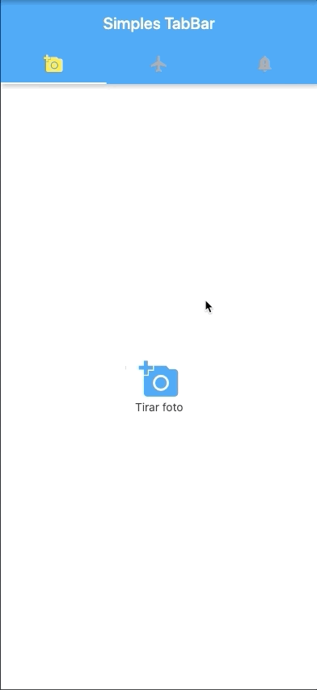

# TabBar/TabBarView

[Documentação oficial do widget](https://api.flutter.dev/flutter/material/TabBar-class.html)

De acordo com a documentação oficial, é um widget do material design  que exibe uma linha horizontal de guias.

Você pode uasar o TabBar no seu [AppBar.bottom](https://api.flutter.dev/flutter/material/AppBar/bottom.html) e tambem pode usa-lo em conjunto com um [TabBarView](https://api.flutter.dev/flutter/material/TabBarView-class.html)

O TabBar precisa de um [TabController](https://api.flutter.dev/flutter/material/TabController-class.html), porém se você não informar esse controlador, você deverá informar um ancestral chamado [DefaultTabController](https://api.flutter.dev/flutter/material/DefaultTabController-class.html), ele disponibiliza um TabController para cada widget descedente :

Vejamos um exemplo do modo mais fácil, e esse modo é ulizar o [DefaultTabController](https://api.flutter.dev/flutter/material/DefaultTabController-class.html):

### 1 - TabBar - DefaultTabController

1ª Vamos ver como é que podemos criar esse controlador:
```DefaultTabController(
length: 3,// Importante lembrar que devemos informar o número de tabs que será exibido.
  child: // Aqui iremos informar como será construido o nosso TabTab.
);
```
O controlador serve para sincronizar o conteúdo exibido com o index do seu TabBar.

2ª Agora vejamos uma maneira de criar as guias ou se preferir pode chama-las de "tabs":
```dart
DefaultTabController(
  length: 3,
  child: Scaffold(
    appBar: AppBar(
      bottom: TabBar(
        tabs: [
          Tab(icon: Icon(Icons.directions_car)),
          Tab(icon: Icon(Icons.directions_transit)),
          Tab(icon: Icon(Icons.directions_bike)),
        ],
      ),
    ),
  ),
);
```
3ª Então podemos criar o conteído de cada guia:
```dart
TabBarView(
  children: [
    Icon(Icons.directions_car),
    Icon(Icons.directions_transit),
    Icon(Icons.directions_bike),
  ],
);
```
4ª Por fim, agora iremos juntar essas partes para chegar a um exemplo completo: 
```dart
import 'package:flutter/material.dart';

void main() {
  runApp(TabBarDemo());
}

class TabBarDemo extends StatelessWidget {
  @override
  Widget build(BuildContext context) {
    return MaterialApp(
      debugShowCheckedModeBanner: false,
      home: DefaultTabController(
        length: 3,
        child: Scaffold(
          appBar: AppBar(
            bottom: TabBar(
            unselectedLabelColor: Colors.grey,
            labelColor: Colors.yellow,
              tabs: [
                Tab(icon: Icon(Icons.add_a_photo)),
                Tab(icon: Icon(Icons.airplanemode_active)),
                Tab(icon: Icon(Icons.notification_important)),
              ],
            ),
            title: Text('Simples TabBar'),
          ),
          body: TabBarView(//O TabBarView mostra uma "pagina" correspondente ao item selecionado na TabBar
            children: [
              Column(
                mainAxisAlignment: MainAxisAlignment.center,
                crossAxisAlignment: CrossAxisAlignment.center,
                children:[
                Icon(Icons.add_a_photo, size:50, color:Colors.blue),
                Text('Tirar foto'),              
              ],
              ),
              Column(
                mainAxisAlignment: MainAxisAlignment.center,
                crossAxisAlignment: CrossAxisAlignment.center,
                children:[
                Icon(Icons.airplanemode_active, size: 50, color:Colors.blue),
                Text('Comprar passagem aérea'),              
              ],
              ),
              Column(
                mainAxisAlignment: MainAxisAlignment.center,
                crossAxisAlignment: CrossAxisAlignment.center,
                children:[
                Icon(Icons.notification_important, size: 50, color:Colors.blue),
                Text('Notificação importante'),              
              ],
              ),              
            ],
          ),
        ),
      ),
    );
  }
}
```

Resultado:


 
 
 Agora vejamos como construir um exemplo com o[TabController](https://api.flutter.dev/flutter/material/TabController-class.html)
 ### 2 - TabBar - TabController
 
 1ª Vamos ver como é que podemos criar esse controlador, para isso devemos criar um mixin com [SingleTickerProviderStateMixin](https://api.flutter.dev/flutter/widgets/SingleTickerProviderStateMixin-mixin.html):
 ```dart
  class _HomePageState extends State<HomePage> with SingleTickerProviderStateMixin{
  TabController _tabController;
  
  //Podemos instanciar esse controlador no initState
  @override
  void initState() {
    //Importante lembrar que devemos informar o número de tabs que será exibido.
    _tabController =  TabController(length: 3, vsync: this);
    super.initState();
  }
 }
 ```
 
 2ª Agora vamos criar nosso [TabBar]((https://api.flutter.dev/flutter/material/TabBar-class.html)):
  ```dart
  TabBar(
  unselectedLabelColor: Colors.grey,
  labelColor: Colors.yellow,
  tabs: [
        Tab(icon: Icon(Icons.add_a_photo)),
        Tab(icon: Icon(Icons.airplanemode_active)),
        Tab(icon: Icon(Icons.notification_important)),
    ],
    controller: _tabController,//Aqui vamos fazer o link do controlador com o nosso TabBar
    indicatorColor: Colors.white,
    indicatorSize: TabBarIndicatorSize.tab,),
  ),
```

3ª Então, na propriedde body do [Scaffold](https://api.flutter.dev/flutter/material/Scaffold-class.html) vamos adicionar nosso [TabBarView](https://api.flutter.dev/flutter/material/TabBarView-class.html):
```dart
body: TabBarView(//O TabBarView mostra uma "pagina" correspondente ao item selecionado na TabBar
    children: [
        Column(
          mainAxisAlignment: MainAxisAlignment.center,
          crossAxisAlignment: CrossAxisAlignment.center,
          children:[
          Icon(Icons.add_a_photo, size:50, color:Colors.blue),
          Text('Tirar foto'),              
        ],
        ),
        Column(
          mainAxisAlignment: MainAxisAlignment.center,
          crossAxisAlignment: CrossAxisAlignment.center,
          children:[
          Icon(Icons.airplanemode_active, size: 50, color:Colors.blue),
          Text('Comprar passagem aérea'),              
        ],
        ),
        Column(
          mainAxisAlignment: MainAxisAlignment.center,
          crossAxisAlignment: CrossAxisAlignment.center,
          children:[
          Icon(Icons.notification_important, size: 50, color:Colors.blue),
          Text('Notificação importante'),              
        ],
        ),
],
controller: _tabController,
),
```
4ª Por fim, agora iremos juntar essas partes para chegar a um exemplo completo: 
```dart
import 'package:flutter/material.dart';

void main() {
  runApp(TabBarDemo());
}

class TabBarDemo extends StatelessWidget {
  final String title;
  const TabBarDemo({Key key, this.title}) : super(key: key);
  @override
  Widget build(BuildContext context) {
    return  MaterialApp(
      debugShowCheckedModeBanner: false,
      home:  HomePage(title: 'Simples TabBar',),
    );
  }
}

class HomePage extends StatefulWidget {
  final String title;
  const HomePage({Key key, this.title}) : super(key: key);
  @override
  _HomePageState createState() => _HomePageState();
}

class _HomePageState extends State<HomePage> with SingleTickerProviderStateMixin{
  
  
  TabController _tabController;

  @override
  void initState() {
    _tabController =  TabController(length: 3, vsync: this);
    super.initState();
  }

  @override
  Widget build(BuildContext context) {
    return  Scaffold(
      appBar:  AppBar(
        title:  Text(widget.title),
        bottom: TabBar(
            unselectedLabelColor: Colors.grey,
            labelColor: Colors.yellow,
              tabs: [
                Tab(icon: Icon(Icons.add_a_photo)),
                Tab(icon: Icon(Icons.airplanemode_active)),
                Tab(icon: Icon(Icons.notification_important)),
              ],
        controller: _tabController,
        indicatorColor: Colors.white,
        indicatorSize: TabBarIndicatorSize.tab,),
      ),
      body: TabBarView(
          children: [
              Column(
                mainAxisAlignment: MainAxisAlignment.center,
                crossAxisAlignment: CrossAxisAlignment.center,
                children:[
                Icon(Icons.add_a_photo, size:50, color:Colors.blue),
                Text('Tirar foto'),              
              ],
              ),
              Column(
                mainAxisAlignment: MainAxisAlignment.center,
                crossAxisAlignment: CrossAxisAlignment.center,
                children:[
                Icon(Icons.airplanemode_active, size: 50, color:Colors.blue),
                Text('Comprar passagem aérea'),              
              ],
              ),
              Column(
                mainAxisAlignment: MainAxisAlignment.center,
                crossAxisAlignment: CrossAxisAlignment.center,
                children:[
                Icon(Icons.notification_important, size: 50, color:Colors.blue),
                Text('Notificação importante'),              
              ],
              ),
      ],
      controller: _tabController,
      ),
    );
  }
}
```
Resultado:


Podemos ver que temos resultados identicos ao utilizar abordagens diferentes de controladores, isso vai depender muito da sua necessidade.

### 3 - Para mais exemplos, veja diretamente na doc oficial:
[Veja mais aqui](https://flutter.dev/docs/cookbook/design/tabsl)
 


    
  

